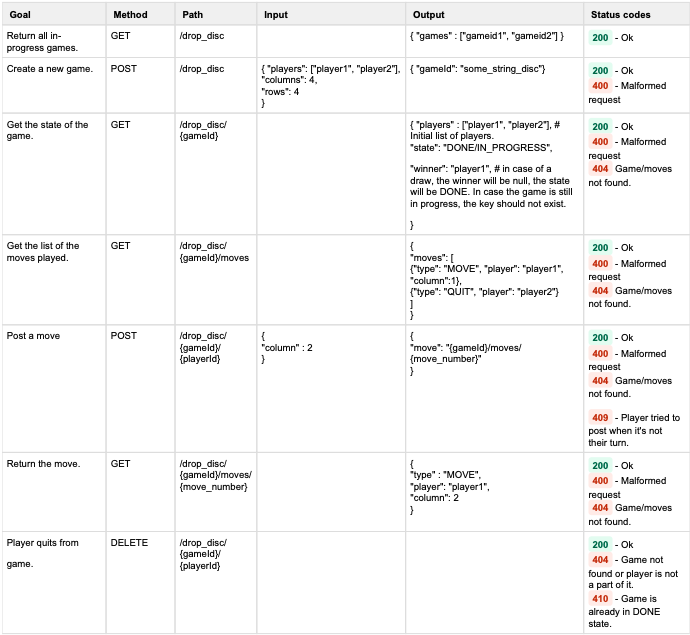
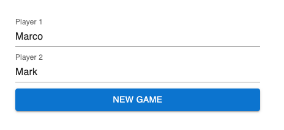
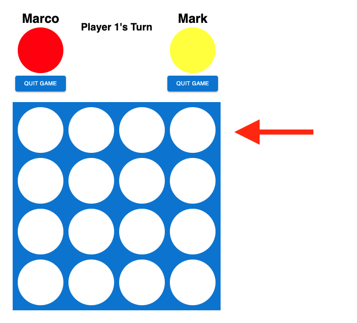

# connect-four

## Description

Full-stack application that will allows 2 players to run a game of Connect 4 on a 4x4 dimension board.

This application will utilize React on the frontend to handle the actual UI, Express.js on the backend to handle the game logic as well as Rest APIs to track make queries to a postgreSQL database. Users should be able both start a new game as well as quit their current game. We will be using local storage to track the gameId which we will use to grab the current state of that specific game.

## Table of Contents

- [Technologies](#technologies)
- [Installation](#installation)
- [Usage](#usage)
- [Tests](#tests)

## Technologies

### React App:
React Hooks<br>
Hooks (useState, useContext, useEffect)<br>
Material UI

### Express.js API Server:
PostgreSQL<br>
Sequelize<br>
Cors<br>

API Endpoints for the Game:



- Get all games
- Create a new game
- Get state of the game
- Get the list of moves played
- Post a move
- Get a move
- Quit from a game

### PostgreSQL DB

The following is the tables for the relational database with a PNG attached for the specifics of each table:
- Games
- Players
- Moves


## Installation

- Clone the project
- Configure database
- Configure backend

    1. ```bash
       cd connect-four-backend
       npm install                      #install packages
       ```

    2. Create .env file using your database credentials (example.env included)

    3. ```bash
       npx dotenv sequelize db:migrate  #create tables in your database
       npm start                        #start api server
       ```

- Configure frontend

    1. ```bash
       cd connect-four-frontend
       npm install                      #install packages
       npm start                        #start the application
       ```

## Usage

To play Connect 4 fill out the form to initialize player 1 and player 2



After you have hit the new game button, you can drop you pieces into any of the 4 columns.
Do this by clicking on the top row of the column you want to place your piece in(see image).
This game follows standard connect four rules and winner will be decided based on those rules.



## Tests

To test each of my endpoints I utilized Postman to be able to send requests and
check the format of the responses. 

Next Steps:
Implement testing using jest and supertest
