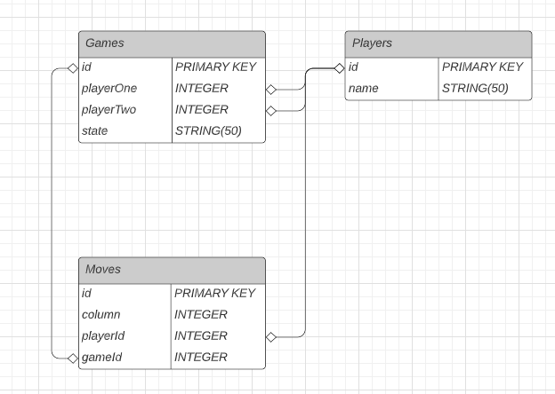

# connect-four

## Description

Full-stack application that will allows 2 players to run a game of Connect 4 on a 4x4 dimension board.

This application will utilize React on the frontend to handle the actual UI, Express.js on the backend to handle the game logic as well as Rest APIs to track make queries to a postgreSQL database. Users should be able both start a new game as well as quit their current game. We will be using local storage to track the gameId which we will use to grab the current state of that specific game.

## Technologies

### React App:
React Hooks 
Hooks (useState, useContext, useHistory, useEffect) 
Material UI

### Express.js API Server:
PostgreSQL 
Sequelize 
API Endpoints for the Game
- Get all games
- Create a new game
- Get state of the game
- Get the list of moves played
- Post a move
- Get a move
- Quit from a game

### PostgreSQL DB

The following is the tables for the relational database with a PNG attached for the specifics of each table:
- Games
- Players
- Moves

## Installation

(in progress)

## Usage

(in progress)

## Tests

To test my routes on the backend I used jest and supertest. In order to run these tests:
(instructions here)
